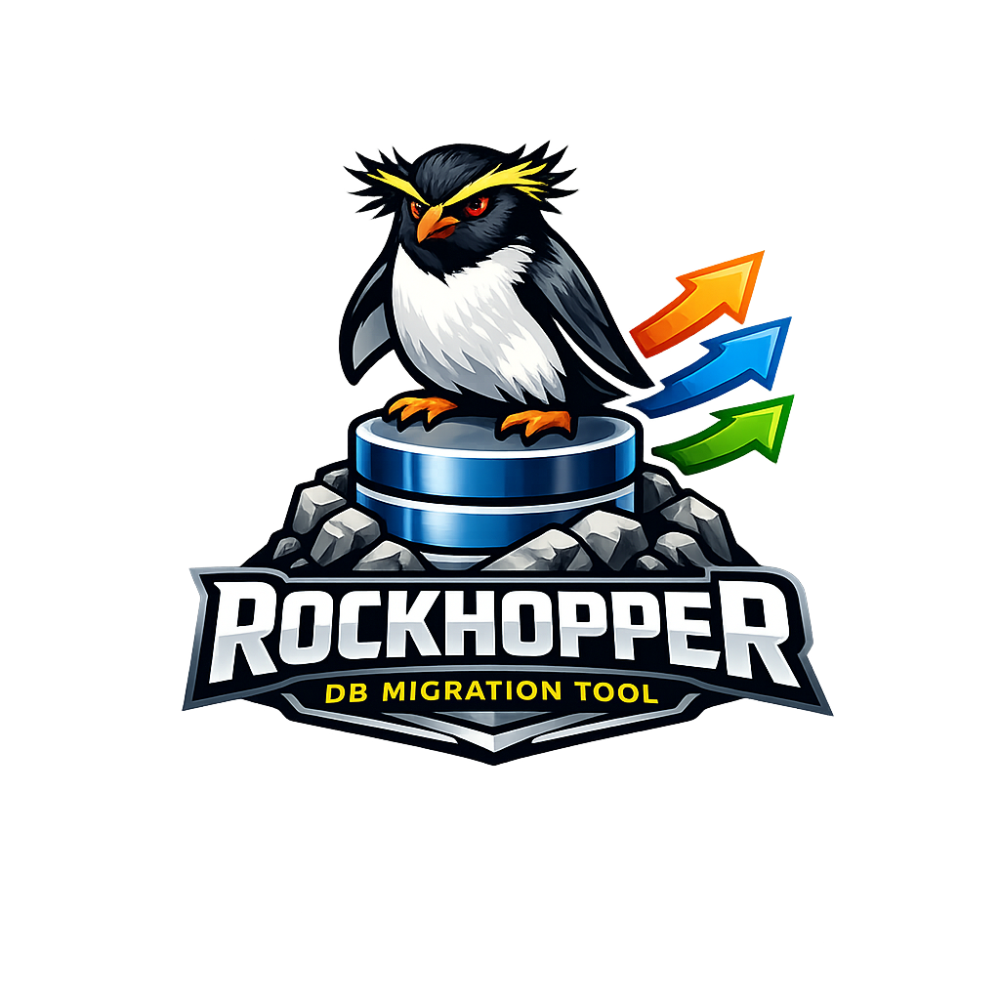

<div align="center">



# rockhopper

**The AI-friendly database migration tool for Go**

</div>

[](https://github.com/c9s/rockhopper/actions/workflows/go.yml)
[](https://pkg.go.dev/github.com/c9s/rockhopper/v2)
[](https://goreportcard.com/report/github.com/c9s/rockhopper/v2)
[](https://claude.ai/code)

**rockhopper** is an embeddable database migration tool written in Go. Compile your SQL migrations into a single, self-contained binary, manage schemas across MySQL, PostgreSQL, and SQLite from one consistent workflow, and let your AI assistant drive the whole thing — create, apply, and roll back migrations in plain English with built-in [Claude Code](https://claude.ai/code) skills.

> 🐧 *Named after the rockhopper penguin — a small bird with a yellowish crest that scales subantarctic cliffs by hopping from rock to rock, the same way you step through migrations one version at a time.*


## Why rockhopper?

- 🤖 **AI-friendly by design** — ships with [Claude Code](https://claude.ai/code) skills so you can create, apply, and roll back migrations conversationally. Drop them into any project with a single `rockhopper skills install`.
- 📦 **Truly embeddable** — compile SQL migrations into Go source and ship them *inside* your binary. No migration files to deploy, no runtime file dependencies.
- 🗄️ **Multi-dialect** — one consistent workflow across MySQL, PostgreSQL, and SQLite3 (plus TiDB and Redshift aliases).
- 🧩 **Package-based** — organize migrations by module and migrate each package independently.
- 🔄 **Goose-compatible** — a familiar migration format, and it auto-migrates legacy `goose_db_version` tables for you.
- 🛠️ **CLI or library** — drive migrations from the cobra-based CLI, or call the Go API directly at app startup.

## Core Concepts

A few ideas explain how rockhopper behaves. Skim these once and the commands below will make sense.

- **Migrations & version IDs** — A migration is a single SQL (or Go) file describing one schema change. Its filename starts with a timestamp (`20240116231445_add_trades_table.sql`); that number is its **version ID**. Rockhopper always applies migrations in ascending version order, so newer changes never run before older ones.

- **Up and down** — Every migration has an `-- +up` block (what to apply) and an optional `-- +down` block (how to undo it). `up` rolls the schema forward; `down` rolls it back.

- **Version tracking table** — Rockhopper records which versions have been applied in a table named `rockhopper_versions`. It creates this table automatically on first run (and transparently migrates from a legacy Goose `goose_db_version` table if it finds one), so it always knows what's pending versus already applied.

- **Packages** — Migrations can be grouped into named **packages** (via `-- @package <name>`, default `main`). Each package tracks its own current version and is migrated independently. This lets a modular application keep, say, a `billing` module's migrations separate from a `users` module's.

- **Dialects** — Rockhopper generates its bookkeeping SQL per database dialect (MySQL, PostgreSQL, SQLite3, and the TiDB/Redshift aliases). Your own migration SQL is dialect-specific too, which is why multi-database projects keep one migration directory per dialect (see [Multi-Dialect Workflow](#multi-dialect-workflow)).

- **Embedding** — `rockhopper compile` turns your SQL files into Go source. You can then ship migrations *inside* your binary and run them at startup with no migration files on disk (see [Compiling Migrations into Go](#compiling-migrations-into-go)).

## Install

```sh
go install github.com/c9s/rockhopper/v2/cmd/rockhopper@v2.0.7
```

## Quick Start

**1. Configure.** Rockhopper looks for `rockhopper.yaml` in the current directory by default. Tell it how to reach your database and where your migration files live:

```yaml
---
driver: mysql      # mysql | postgres | sqlite3
dialect: mysql     # SQL dialect (defaults to driver if omitted)
dsn: "root@tcp(localhost:3306)/rockhopper?parseTime=true"
package: myapp     # default package name for new migrations
migrationsDirs:    # one or more directories rockhopper scans for migrations
- migrations/module1
- migrations/module2
```

**2. Create the migration directories** referenced above:

```sh
mkdir -p migrations/{module1,module2}
```

**3. Generate a migration file.** This writes an empty, timestamped template you then fill in:

```sh
rockhopper create -t sql --output migrations/module1 add_trades_table
# -> migrations/module1/20240116231445_add_trades_table.sql
```

**4. Edit the file** to add your `-- +up` and `-- +down` SQL (see [SQL Migration Format](#sql-migration-format)).

**5. Apply pending migrations.** Rockhopper applies everything not yet recorded in the version table, in version order:

```sh
rockhopper up
```

**6. Inspect what happened** at any time with `status`:

```sh
rockhopper status
```

```
+---------+----------------+---------------------------------------------------------+--------------------------+---------+
| PACKAGE |     VERSION ID | SOURCE FILE                                             | APPLIED AT               | CURRENT |
+---------+----------------+---------------------------------------------------------+--------------------------+---------+
| app1    | 20240116231445 | migrations/mysql/app1/20240116231445_create_table_1.sql | Fri Jan 19 15:34:51 2024 | -       |
| app1    | 20240116231513 | migrations/mysql/app1/20240116231513_create_table_2.sql | Fri Jan 19 15:34:51 2024 | *       |
+---------+----------------+---------------------------------------------------------+--------------------------+---------+
| app2    | 20240117132418 | migrations/mysql/app2/20240117132418_create_table_1.sql | Fri Jan 19 15:34:51 2024 | -       |
| app2    | 20240117132421 | migrations/mysql/app2/20240117132421_create_table_2.sql | Fri Jan 19 15:34:51 2024 | *       |
+---------+----------------+---------------------------------------------------------+--------------------------+---------+
|         |                | MIGRATIONS                                              | 4                        |         |
+---------+----------------+---------------------------------------------------------+--------------------------+---------+
```

Roll back a single migration:

```sh
rockhopper down
```

Redo the last migration (down then up):

```sh
rockhopper redo
```

## CLI Commands

### Global Flags

| Flag | Default | Description |
|---|---|---|
| `--config` | `rockhopper.yaml` | Path to config file |
| `--debug` | `false` | Enable debug logging |

### `up` — Apply pending migrations

```sh
rockhopper up                       # apply all pending migrations
rockhopper up --steps 3             # apply the next 3 pending migrations
rockhopper up --to 20240117         # apply up to a specific version
rockhopper up --allow-out-of-order  # also apply pending migrations older than the latest applied
```

| Flag | Description |
|---|---|
| `--steps` | Number of migrations to apply |
| `--to` | Target version to migrate up to |
| `--allow-out-of-order` | Apply pending migrations whose version is below an already-applied migration |

#### Out-of-order migrations

When you work on parallel branches, a teammate can merge a migration with a
timestamp *lower* than one you have already applied. By default `up` **refuses**
to run in this situation and lists the offending files, because a normal upgrade
walks forward from the last applied migration and would silently skip them:

```
out-of-order migrations detected in package "main": the following are pending but
have a lower version than the highest applied migration (20240103000000), so a
normal upgrade would silently skip them:
  - 20240102000000  migrations/20240102000000_b.sql
re-run with --allow-out-of-order to apply them anyway, or renumber them above the latest applied version
```

You then have two choices:

- **Renumber** the new migration so its version is above the latest applied one (the safe default — history stays linear).
- **Apply it in place** with `rockhopper up --allow-out-of-order`. Rockhopper warns for each out-of-order migration and applies it. Use this only when the older migration is independent of the newer ones, since it changes the applied order.

### `down` — Roll back migrations

```sh
rockhopper down              # roll back the last applied migration
rockhopper down --steps 3    # roll back the last 3 migrations
rockhopper down --to 20240116  # roll back down to a specific version
rockhopper down --all        # roll back all applied migrations
```

| Flag | Description |
|---|---|
| `--steps` | Number of migrations to roll back |
| `--to` | Target version to roll back to |
| `--all` | Roll back all migrations |

### `redo` — Redo the last migration

Rolls back the last applied migration, then re-applies it:

```sh
rockhopper redo
```

### `status` — Show migration status

Lists every known migration per package and whether it has been applied:

```sh
rockhopper status
```

In the output, the **Applied At** column shows the timestamp when a migration ran (or `Pending` if it hasn't), and the **Current** column marks each package's current version with `*` (all other rows show `-`).

### `version` — Print the version

Prints the rockhopper build version, commit, and build time. This command works without a config file:

```sh
rockhopper version
# rockhopper v2.0.7 (commit abc1234, built 2024-01-19T12:00:00Z)
```

### `create` — Create a new migration file

```sh
rockhopper create -t sql --output migrations/mysql add_trades_table
rockhopper create -t go --output migrations add_custom_logic
```

| Flag | Default | Description |
|---|---|---|
| `-t`, `--type` | `sql` | Migration type: `sql` or `go` |
| `-o`, `--output` | from config | Output directory for the migration file |

Migration files are named with a timestamp prefix: `{YYYYMMDDhhmmss}_{name}.sql`

### `compile` — Compile SQL migrations into Go

```sh
rockhopper compile --output pkg/migrations/mysql
rockhopper compile --output pkg/migrations/mysql --package main --package app2
rockhopper compile --output pkg/migrations/mysql --no-build
```

| Flag | Default | Description |
|---|---|---|
| `-o`, `--output` | `pkg/migrations` | Output directory for the generated Go package |
| `-p`, `--package` | all | Filter specific packages to compile (repeatable) |
| `-B`, `--no-build` | `false` | Skip building the package after compiling |

### `align` — Align migration version

Synchronize the database state to a specific migration version:

```sh
rockhopper align main 20240116231445
```

Arguments: `<packageName> <versionID>`

## Configuration

### Config File

Pass `--config` to use a different config file:

```sh
rockhopper --config rockhopper_sqlite.yaml status
```

### Config Fields

```yaml
---
driver: mysql                    # Database driver: mysql, sqlite3, postgres
dialect: mysql                   # SQL dialect (defaults to driver if omitted)
dsn: "root@tcp(localhost:3306)/mydb?parseTime=true"
package: myapp                   # Default package name (defaults to "main")
migrationsDirs:                  # List of migration directories
- migrations/module1
- migrations/module2
includePackages:                 # Optional: only include these packages
- main
- app2
```

| Field | Default | Description |
|---|---|---|
| `driver` | | Database driver: `mysql`, `sqlite3`, `postgres` |
| `dialect` | same as driver | SQL dialect for query generation. Also supports `tidb` (uses mysql) and `redshift` (uses postgres) |
| `dsn` | | Data source name / connection string |
| `package` | `main` | Default migration package name |
| `migrationsDir` | `migrations` | Single migration directory (use `migrationsDirs` for multiple) |
| `migrationsDirs` | | List of migration directories |
| `includePackages` | all | Whitelist of packages to include when loading migrations |

> The version-tracking table is always named `rockhopper_versions` when using the CLI. To use a custom table name, call the library's `Open` / `New` functions directly and pass your own name (see [Go API](#go-api)).

## SQL Migration Format

A simple migration:

```sql
-- +up
CREATE TABLE post (
    id int NOT NULL,
    title text,
    body text,
    PRIMARY KEY(id)
);

-- +down
DROP TABLE post;
```

Each migration file must have exactly one `-- +up` annotation. The `-- +down` annotation is optional. If both are present, `-- +up` must come first.

### Annotations

| Annotation | Description |
|---|---|
| `-- +up` | Statements following this are executed on upgrade |
| `-- +down` | Statements following this are executed on rollback |
| `-- +begin` / `-- +end` | Wrap multi-statement blocks (e.g. PL/pgSQL with internal semicolons) |
| `-- !txn` | Disable transaction wrapping for this file (e.g. `CREATE DATABASE`) |
| `-- @package name` | Assign this migration to a named package (default: `main`) |

### Multi-statement example

```sql
-- +up
-- +begin
create or replace procedure prac_transfer(
   sender int,
   receiver int,
   amount dec
)
language plpgsql
as $$
begin
    update accounts
    set balance = balance - amount
    where id = sender;

    update accounts
    set balance = balance + amount
    where id = receiver;

    commit;
end;$$;
-- +end
```

### Non-transactional migrations

Use `-- !txn` for statements that cannot run inside a transaction:

```sql
-- +up
-- !txn
CREATE INDEX CONCURRENTLY idx_users_email ON users (email);

-- +down
-- !txn
DROP INDEX CONCURRENTLY idx_users_email;
```

### Package-based migrations

Use `-- @package <name>` to assign migrations to named packages. Rockhopper groups and executes them per package:

```sql
-- @package billing
-- +up
CREATE TABLE invoices (id INT PRIMARY KEY, amount DECIMAL(10,2));

-- +down
DROP TABLE invoices;
```

1. Collect all migration scripts
2. Categorize by package name
3. Execute migrations package by package

The default package name is `main`. Use `includePackages` in your config to selectively apply only certain packages.

## Multi-Dialect Workflow

When supporting multiple databases (e.g. MySQL and SQLite), maintain separate config files and migration directories:

```sh
# Create migration files for each dialect
rockhopper --config rockhopper_sqlite.yaml create --type sql add_pnl_column
rockhopper --config rockhopper_mysql.yaml create --type sql add_pnl_column

# Edit both files — SQL syntax may differ between dialects

# Apply migrations
rockhopper --config rockhopper_sqlite.yaml up
rockhopper --config rockhopper_mysql.yaml up
```

## Compiling Migrations into Go

Compile SQL migrations into a Go package for embedding in your binary:

```sh
rockhopper compile --config rockhopper_mysql.yaml --output pkg/migrations/mysql
rockhopper compile --config rockhopper_sqlite.yaml --output pkg/migrations/sqlite3
```

The generated package provides:

- `Migrations()` — returns all compiled migrations as a sorted `MigrationSlice`
- `SortedMigrations()` — alias for `Migrations()`
- `GetMigrationsMap()` — returns migrations grouped by package
- `MergeMigrationsMap()` — merge additional migrations at runtime
- `AddMigration()` — register new migrations dynamically

Then import and use the compiled migrations in your application:

```go
import (
    "context"
    "database/sql"

    "github.com/c9s/rockhopper/v2"

    mysqlMigrations "github.com/yourorg/yourapp/pkg/migrations/mysql"
)

func Migrate(ctx context.Context, db *sql.DB) error {
    dialect, err := rockhopper.LoadDialect("mysql")
    if err != nil {
        return err
    }

    rh := rockhopper.New("mysql", dialect, db, rockhopper.TableName)

    if err := rh.Touch(ctx); err != nil {
        return err
    }

    migrations := mysqlMigrations.Migrations()
    migrations = migrations.FilterPackage([]string{"main"}).SortAndConnect()
    if len(migrations) == 0 {
        return nil
    }

    _, lastAppliedMigration, err := rh.FindLastAppliedMigration(ctx, migrations)
    if err != nil {
        return err
    }

    if lastAppliedMigration != nil {
        return rockhopper.Up(ctx, rh, lastAppliedMigration.Next, 0)
    }

    return rockhopper.Up(ctx, rh, migrations.Head(), 0)
}
```

## Go API

Rockhopper can be used as a library in your Go application. Below are the key APIs.

### Opening a Database Connection

```go
// From a config struct
db, err := rockhopper.OpenWithConfig(config)

// From environment variables (reads MYAPP_DRIVER, MYAPP_DIALECT, MYAPP_DSN)
db, err := rockhopper.OpenWithEnv("MYAPP")

// Manual setup
dialect, _ := rockhopper.LoadDialect("mysql")
db, err := rockhopper.Open("mysql", dialect, dsn, rockhopper.TableName)

// Wrap an existing *sql.DB
dialect, _ := rockhopper.LoadDialect("mysql")
rh := rockhopper.New("mysql", dialect, existingDB, rockhopper.TableName)
```

### Running Migrations

```go
// Apply all pending migrations (pass 0 as target version to apply all)
rockhopper.Up(ctx, db, migrations.Head(), 0)

// Apply N steps
rockhopper.UpBySteps(ctx, db, migrations.Head(), 3)

// Apply all pending migrations across all packages
rockhopper.Upgrade(ctx, db, migrations)

// Apply from compiled Go migrations by package name
rockhopper.UpgradeFromGo(ctx, db, "main", "app2")

// Roll back to a specific version (pass 0 to roll back all)
rockhopper.Down(ctx, db, migrations.Tail(), 0)

// Roll back N steps
rockhopper.DownBySteps(ctx, db, migrations.Tail(), 3)

// Redo the last migration (down then up)
rockhopper.Redo(ctx, db, lastMigration)

// Align database to a specific version
rockhopper.Align(ctx, db, versionID, migrations)
```

Migration functions accept optional callbacks that fire after each migration is applied:

```go
rockhopper.Up(ctx, db, migrations.Head(), 0, func(m *rockhopper.Migration) {
    log.Printf("applied migration %d: %s", m.Version, m.Name)
})
```

### Working with MigrationSlice

```go
migrations := mysqlMigrations.Migrations()

// Filter by package and prepare the linked list
filtered := migrations.FilterPackage([]string{"main", "app2"}).SortAndConnect()

// Traverse
first := filtered.Head()
last := filtered.Tail()
versions := filtered.Versions() // []int64

// Find a specific version
m, err := filtered.Find(20240116231445)

// Group by package
migrationMap := migrations.MapByPackage()
```

### Loading SQL Migrations at Runtime

```go
loader := rockhopper.NewSqlMigrationLoader(config)
migrations, err := loader.Load("migrations/mysql")
```

### Registering Go Migrations

For Go-based migrations (instead of SQL files), register them from `init()`:

```go
package migrations

import (
    "context"

    "github.com/c9s/rockhopper/v2"
)

func init() {
    rockhopper.AddMigration(upAddUsers, downAddUsers)
}

func upAddUsers(ctx context.Context, tx rockhopper.SQLExecutor) error {
    _, err := tx.ExecContext(ctx, "CREATE TABLE users (id INT PRIMARY KEY, name TEXT)")
    return err
}

func downAddUsers(ctx context.Context, tx rockhopper.SQLExecutor) error {
    _, err := tx.ExecContext(ctx, "DROP TABLE users")
    return err
}
```

### Database Initialization

`Touch()` automatically creates the version table if it doesn't exist, and migrates from legacy Goose tables if detected:

```go
if err := db.Touch(ctx); err != nil {
    return err
}
```

### Querying Migration State

```go
// Get current version for a package
version, err := db.CurrentVersion(ctx, "main")

// Load a specific migration's record from the database
m, err := db.LoadMigration(ctx, migration)
if m != nil && m.Record != nil && m.Record.IsApplied {
    // migration has been applied
}

// Load all records for a package
records, err := db.LoadMigrationRecordsByPackage(ctx, "main")

// Find the last applied migration from a slice
idx, lastApplied, err := db.FindLastAppliedMigration(ctx, migrations)
```

## Environment Variables

You can override config file values with environment variables:

| Variable | Description |
|---|---|
| `ROCKHOPPER_DRIVER` | Database driver: `mysql`, `sqlite3`, `postgres` |
| `ROCKHOPPER_DIALECT` | SQL dialect for query generation |
| `ROCKHOPPER_DSN` | Data source name / connection string |
| `ROCKHOPPER_MIGRATIONS_DIR` | Single migration directory |
| `ROCKHOPPER_MIGRATIONS_DIRS` | Migration directories (comma-separated) |
| `ROCKHOPPER_TABLE_NAME` | Custom version table name |

Example with [dotenv](https://github.com/joho/godotenv):

```sh
dotenv -f .env.local -- rockhopper --config rockhopper_mysql.yaml up
```

## Claude Code Support

Rockhopper ships with built-in [Claude Code](https://claude.ai/code) skills, so you can manage migrations conversationally from your terminal. The following slash commands are available when working in a rockhopper-based project:

| Command | Description |
|---|---|
| `/create-migration <name>` | Create migration files for all configured dialects at once |
| `/compile-migrations` | Compile SQL migrations into Go source for embedding |
| `/apply-migrations` | Apply pending migrations (`up`) |
| `/rollback-migration` | Roll back the last applied migration (`down`) with confirmation |
| `/migration-status` | Show migration status across all configured databases |

These skills auto-discover `rockhopper_*.yaml` config files in your project root, so they work out of the box for any multi-dialect setup.

### Installing the skills into your project

The skills are bundled inside the `rockhopper` binary. Any project that uses rockhopper can scaffold them into its own `.claude/skills` directory with a single command:

```sh
# from the root of your project
rockhopper skills install

# list the skills bundled in the binary
rockhopper skills list
```

| Flag | Default | Description |
|---|---|---|
| `-d`, `--dir` | `.` | Target project directory |
| `-f`, `--force` | `false` | Overwrite existing skill files |

`skills install` works without a config file, so you can run it before configuring rockhopper. Existing files are left untouched unless you pass `--force`. Because the skills ship inside the binary, they stay in sync with the CLI — after upgrading rockhopper, re-run `rockhopper skills install --force` to pick up the matching versions. Commit the generated `.claude/skills` directory so the whole team shares the same migration tooling.

There is also a helper script `scripts/create-migration.sh` that can be used independently:

```sh
# Create migration files for all dialects
bash scripts/create-migration.sh add_pnl_column

# Specify migration type
bash scripts/create-migration.sh -t sql add_trades_table
```

## Credit

Thanks to <https://github.com/pressly/goose>, this project was forked from goose.

## License

MIT License
